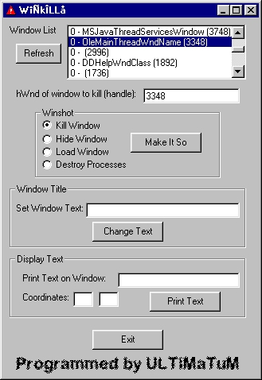

## WinKilla \- Runtime Disassembler

### Description

**UPDATED FOR NT SUPPORT**

Spy++ is good, if you like LOOKING at what's loaded in Windows. WinKilla takes that extra step. WinKilla is actually Windows disassembler, minus the procedure watches (which are being added, by the way). However, WinKilla actually lets you TAKE CONTROL of all classes derived from the C++ CWnd class! This means that not only can you play around with all visible windows, but you can also tinker around with HIDDEN WINDOWS, ALL CONTROLS and PROCESSES! Imagine changing the text on a command button that isn't even made in VB from a program that you didn't even make =) Take a look. This is probably one of my best works yet.
 
### More Info
 

             |
---                |---
**Submitted On**   |2000-03-16 16:12:52
**By**             |[Jonathan Smith](https://github.com/Planet-Source-Code/PSCIndex/blob/master/ByAuthor/jonathan-smith.md)
**Level**          |Advanced
**User Rating**    |4.8 (38 globes from 8 users)
**Compatibility**  |VB 4\.0 \(32\-bit\), VB 5\.0, VB 6\.0
**Category**       |[Complete Applications](https://github.com/Planet-Source-Code/PSCIndex/blob/master/ByCategory/complete-applications__1-27.md)
**World**          |[Visual Basic](https://github.com/Planet-Source-Code/PSCIndex/blob/master/ByWorld/visual-basic.md)
**Archive File**   |[CODE\_UPLOAD40223162000\.zip](https://github.com/Planet-Source-Code/jonathan-smith-winkilla-runtime-disassembler__1-6621/archive/master.zip)

